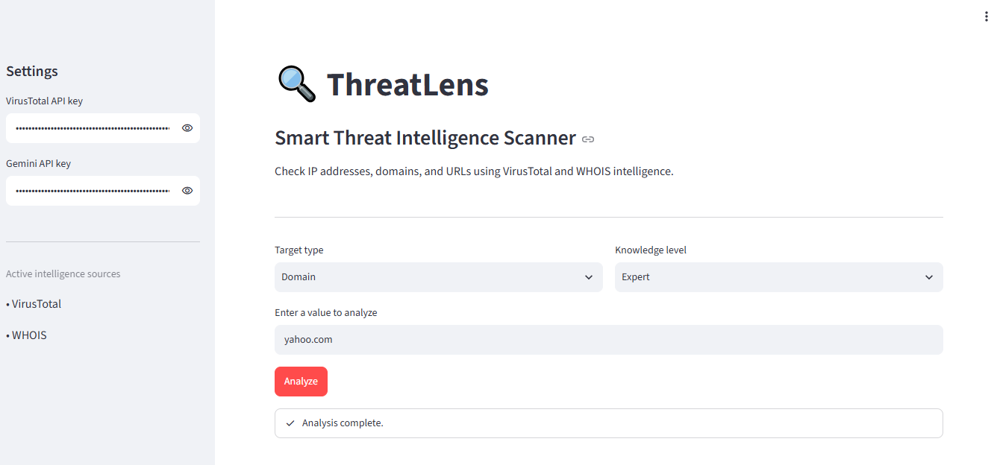

# 🛡️ ThreatLens — AI-Powered Threat Intelligence Scanner

ThreatLens is a beginner-friendly cybersecurity application that analyzes domains and URLs using threat intelligence data and AI-powered insights.
